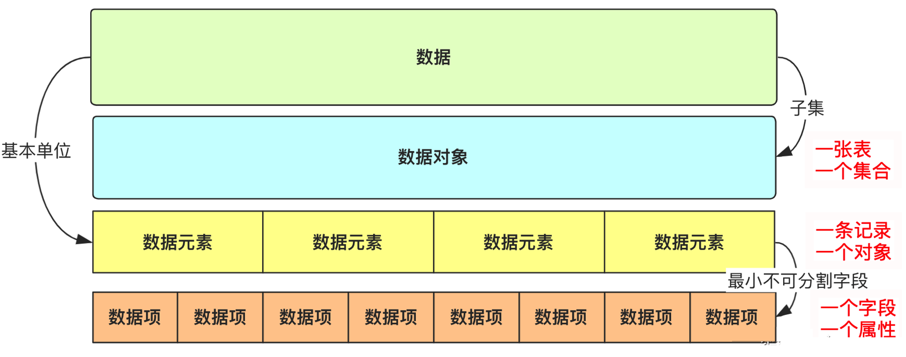

# 数据结构总复习

## 题型

1. 选择题 30=15x2'
2. 填空题 30=10x3'
3. 编程题 40=2~3道

#### 1.若线性表最常用的操作是存取第i个元素及其前驱元素的值，则采用_____存储方式节省时间：

A. 单链表     B. 双链表     C. 单循环链表     D. 顺序表

> 解析:
>| 存储方式 |  查找时间复杂度  | 插入/删除时间复杂度 |
>| ------ |------ |------ |
>| 顺序表 | O(1) | O(n)|
>| 链式存储 | O(n) | O(1)|

#### 2.将一棵有100个结点的完全二叉树从根这一层开始，每一层从左到右依次对结点进行编号，根结点编号为1，则编号为49的结点的左孩子的编号为______ 
A. 98         B. 99         C. 50             D. 48
> 解析: 
> 如果`i >= 1`, i 的左儿子 = `2 * i`, 右儿子 = `2 * i + 1`, 父亲 = `[i/2]`, `i <= n` 
> 如果`i >= 0`, i 的左儿子 = `2 * i + 1`, 右儿子 = `2 * i + 2`, 父亲 = `[(i - 1) / 2]`,`i < n`

#### 3.数据结构中，数据的最小单位是_______。
A. 数据元素    B. 字节        C. 数据项          D. 结点
> 解析: 
>